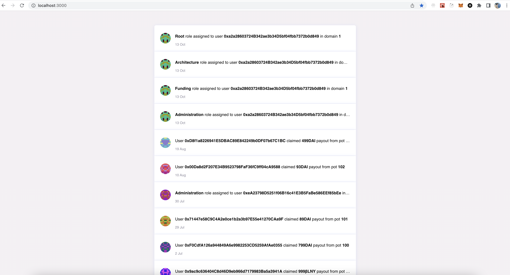

# Colony Events List

A simple events list display. Using the latest version 2 of Colony's open source library and the version 4 of ethers.js.

**To run this app:**
- 'npm install' in main folder
- 'npm start' to run the app

